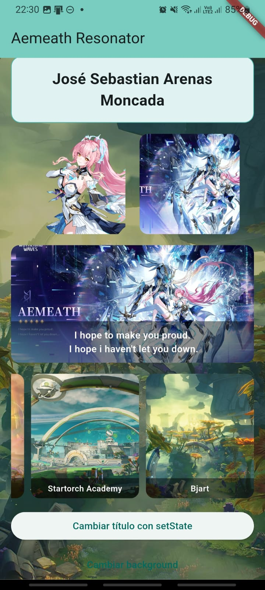

# Desarrollo Movil - Taller Flutter

### Datos
- **Nombre completo:** Jose Sebastian Arenas Moncada
- **Codigo:** 230231036
## Descripcion breve del taller
Este taller consiste en construir una pantalla principal en Flutter usando widgets basicos e interaccion con estado.
La app incluye:
- AppBar con titulo dinamico.
- Texto centrado con datos del estudiante.
- Uso de imagenes locales y de red.
- Botones con `setState()` para cambiar contenido visual.
- Secciones adicionales como `Stack` y `GridView` horizontal con scroll.

## Pasos para ejecutar
1. Abrir una terminal en la raiz del proyecto.
2. Instalar dependencias:

```bash
flutter pub get
```
3. Selecionar el dispositivo a mostrar
```bash
ctrl + shift + p 
>flutter: Select Device
```

4. Ejecutar la aplicacion:


```bash
flutter run
```

### Capturas de la app
- Captura 1: Pantalla principal


- Captura 2: Cambio de fondo con TextButton y Grid



