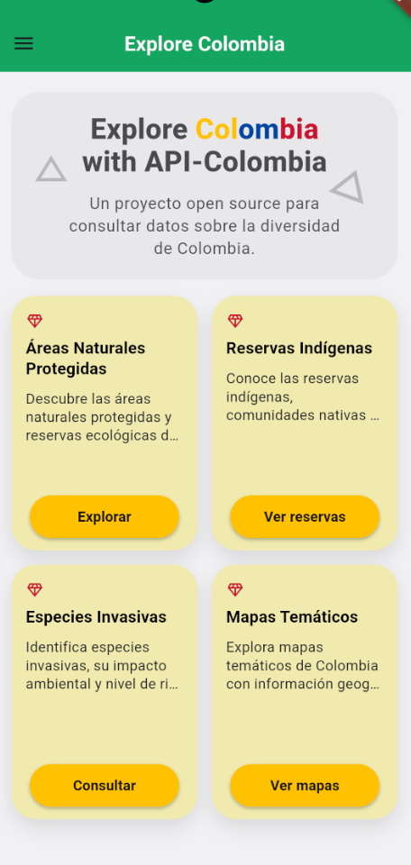
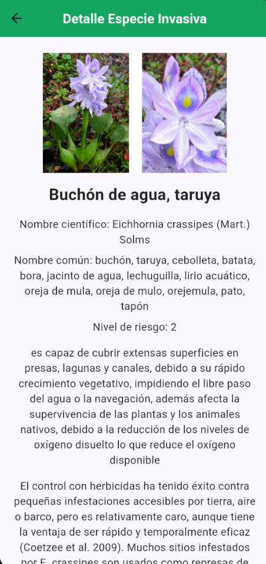
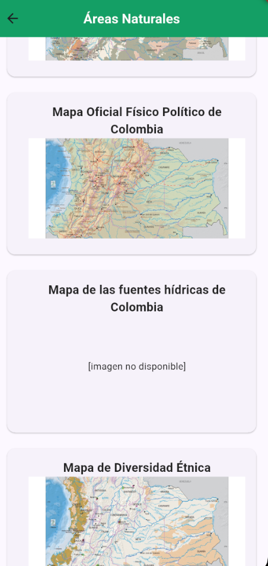

# Desarrollo Movil - API Colombia

## Descripcion del proyecto

Se construyo una aplicación en flutter para consumir la API de colombia y mostrar información de interes de minimo 4 endpoints, manteniendo una estructura organizada en carpetas y un flujo de trabajo claro. se integra `go_router` para la navegación entre vistas, peticiones HTTP con `Future` para evitar bloqueos en la IU mientras se cargan los datos desde el servicio.

## API usada

Se consume la API publica de Colombia desde la siguiente base:

- Base URL: https://api-colombia.com/api/v1

Endpoints seleccionados:

- `CategoryNaturalArea`
- `IndigenousReservation`
- `InvasiveSpecie`
- `Map`

Ademas de su respectivo `$id` para una vista detallada del item seleccionado

## Ejemplos de respuesta JSON

### 1. CategoryNaturalArea

```json
{
  "id": 1,
  "name": "Área Natural Única",
  "description": "Área geográfica que, por poseer condiciones especiales de flora o gea es un escenario natural raro.",
  "naturalAreas": null
}
```

### 2. IndigenousReservation

```json
{
  "id": 1,
  "name": "Pared Y Parecito",
  "code": "10301",
  "procedureType": "LEGALIZACIÓN DECRETO 1071",
  "administrativeActType": "RESOLUCIÓN",
  "administrativeActNumber": 18,
  "administrativeActDate": "2003-04-10T00:00:00Z",
  "nativeCommunity": {
    "id": 16,
    "name": "Embera",
    "description": "Pueblo amerindio que habita en zonas del Pacífico y regiones cercanas.",
    "languages": "Emberá",
    "images": ["https://.../16-embera.jpg"]
  }
}
```

### 3. InvasiveSpecie

```json
{
  "id": 1,
  "name": "Acacia negra, gris",
  "scientificName": "Acacia decurrens Willd",
  "commonNames": "acacia ceniza, acacia",
  "impact": "...",
  "manage": "...",
  "riskLevel": 2,
  "urlImage": "https://.../1- Acacia negra, gris.png"
}
```

### 4. Map

```json
{
  "id": 1,
  "nombre": "Mapa de Colombia",
  "descripcion": "Mapa tematico del territorio nacional.",
  "departamento": "Antioquia",
  "imagen": "https://.../mapa.png",
  "url": "https://..."
}
```

## Arquitectura y estructura del proyecto

El proyecto sigue una estructura sencilla por capas:

- `lib/models/`: modelos de datos y conversion desde JSON.
- `lib/services/`: consumo de endpoints HTTP y obtencion de datos.
- `lib/views/`: vistas del dashboard, listados y detalles.
- `lib/widgets/`: widgets reutilizables como `BaseView` y `CustomDrawer`.
- `lib/routes/`: configuracion de rutas con `go_router`.
- `lib/themes/`: configuracion visual del tema.

### Modelos

Los modelos transforman la respuesta JSON de la API en objetos Dart.

- `lib/models/tiposAreaNatural.dart`
- `lib/models/comunidadNativa.dart`
- `lib/models/reservaIndigena.dart`
- `lib/models/especiesInvasivas.dart`
- `lib/models/mapas.dart`

### Services

Los services encapsulan la logica de peticiones HTTP.

- `lib/services/areaNaturalService.dart`
- `lib/services/reservasIndigenasService.dart`
- `lib/services/especiesInvasivasService.dart`
- `lib/services/mapasService.dart`

### Views

Las vistas muestran la informacion en pantalla con `FutureBuilder`, `ListView.builder` y pantallas de detalle.

- `lib/views/home/home_screen.dart`
- `lib/views/areasNaturales/areaNaturalListView.dart`
- `lib/views/areasNaturales/detallesAreasNaturales.dart`
- `lib/views/reservasIndigenas/reservasIndigenasListView.dart`
- `lib/views/reservasIndigenas/detallesReservasIndigenas.dart`
- `lib/views/especiesInvasivas/especiesInvasivasListView.dart`
- `lib/views/especiesInvasivas/detallesEspeciesInvasivas.dart`
- `lib/views/mapas/mapasListView.dart`
- `lib/views/mapas/detallesMapas.dart`

### Widgets reutilizables

- `lib/widgets/base_view.dart`: estructura base de cada pantalla con `AppBar` y `Drawer`.
- `lib/widgets/custom_drawer.dart`: menu lateral de navegacion.

## Rutas implementadas con go_router

Las rutas estan definidas en `lib/routes/app_router.dart`.

### Rutas principales

- `/` -> Dashboard principal
- `/area-natural` -> Listado de areas naturales
- `/area-natural/:id` -> Detalle de area natural
- `/reservas-indigenas` -> Listado de reservas indigenas
- `/reservas-indigenas/:id` -> Detalle de reserva indigena
- `/especies-invasivas` -> Listado de especies invasivas
- `/especies-invasivas/:id` -> Detalle de especie invasiva
- `/mapas` -> Listado de mapas
- `/mapas/:id` -> Detalle de mapa

### Parametros enviados

En los listados se navega enviando el `id` del registro seleccionado:

```dart
context.push('/area-natural/${areaNatural.id}');
context.push('/reservas-indigenas/${reserva.id}');
context.push('/especies-invasivas/${especie.id}');
context.push('/mapas/${mapa.id}');
```

En las rutas detalle se recupera el parametro con:

```dart
final id = state.pathParameters['id']!;
```

## Manejo de estados

La app usa `FutureBuilder` para manejar el ciclo de vida de carga de datos.

Estados implementados:

- **Carga**: `CircularProgressIndicator()` mientras llega la respuesta.
- **Exito**: renderizado del listado o del detalle cuando `snapshot.hasData`.
- **Error**: muestra el mensaje con `snapshot.hasError`.
- **Fallback de datos vacios**: muestra textos como `Sin nombre`, `Sin descripcion`, `Sin departamento` o `Sin dato` cuando algun campo llega vacio.

## Capturas

### Dashboard



### Listado


### Detalle



### Manejo de estados
En caso de que alguna imagen no este disponible o no se cargue correctamente



## Como ejecutar el proyecto

1. Instalar dependencias:

```bash
flutter pub get
```

2. Ejecutar la aplicacion:

```bash
flutter run
```

## Variables de entorno

El proyecto usa `flutter_dotenv` y carga el archivo:

- `lib/config/.env`

Ejemplo:

```env
API_URL=https://api-colombia.com/api/v1
```

## Notas finales

- La app esta organizada por capas simples y separadas.
- La navegacion principal se controla desde `go_router`.
- Cada endpoint tiene su listado y su detalle.
- Los modelos toleran  valores nulos para evitar errores al mapear JSON.
